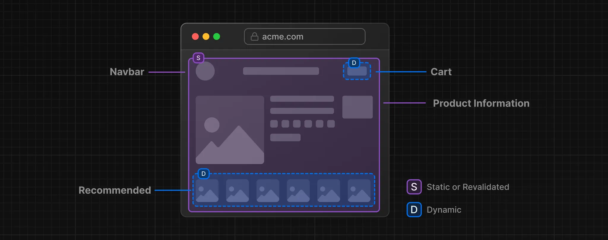

# Partial Pre-Rendering (PPR)

## Pengantar Partial Pre-Rendering

Sebagian besar aplikasi web modern memungkinkan kita untuk memilih antara rendering statis atau dinamis untuk seluruh bagian halaman. Namun, tidak semua bagian dari halaman perlu dirender secara keseluruhan dengan satu metode. Dalam beberapa kasus, hanya sebagian dari halaman yang memerlukan rendering dinamis.

Sebagai contoh, dalam aplikasi e-commerce, ada beberapa elemen yang bersifat statis, seperti informasi produk. Namun, untuk menampilkan data seperti jumlah produk dalam keranjang belanja pengguna atau rekomendasi produk, kita memerlukan rendering secara dinamis seperti pada ilustrasi gambar di bawah

<!-- image. -->


Oleh karena itu, untuk mencapai performa yang lebih optimal, kita dapat menggunakan Partial Pre Rendering.

## Apa itu Partial Pre-Rendering (PPR)?

Next.js 15 memperkenalkan **Partial Pre-Rendering (PPR)**, sebuah model rendering yang memungkinkan sebagian halaman dirender di server, sementara bagian lainnya di sisi klien. PPR menggabungkan **Static Rendering** dan **Dynamic Rendering** dalam satu halaman, sehingga memungkinkan performa yang lebih optimal dengan tetap mempertahankan pengalaman pengguna yang responsif.

## Bagaimana Cara Kerja Partial Pre-Rendering?

1. **Fallback Suspense**  
   Partial Pre-Rendering memanfaatkan fitur Suspense dari React untuk menunda rendering pada bagian-bagian tertentu. Dengan Suspense, kita dapat menentukan tampilan sementara (fallback) yang akan ditampilkan saat data dinamis sedang dimuat. Fallback ini disertakan dalam file HTML di awal bersama konten statis.

2. **Prerendering Static Content**  
   Pada tahap build (atau saat melakukan revalidasi), konten statis dirender terlebih dahulu sebagai **static shell**. Ini berarti bahwa bagian tersebut sudah siap ketika pengguna pertama kali mengunjungi halaman, sementara konten dinamis baru dirender setelah pengguna meminta data.

> Penting untuk diperhatikan bahwa membungkus komponen dengan Suspense tidak menjadikannya komponen dinamis; Suspense hanya berfungsi sebagai batas antara konten statis dan dinamis.

## Implementasi Partial Pre-Rendering di Next.js

### Langkah-langkah Implementasi PPR

1. **Aktifkan PPR di `next.config.mjs`**  
   Tambahkan opsi [`ppr`](https://rc.nextjs.org/docs/app/api-reference/next-config-js/ppr) di dalam file `next.config.mjs` untuk mengaktifkan Partial Pre-Rendering.

    ```javascript
    /** @type {import('next').NextConfig} */
    const nextConfig = {
      experimental: {
        ppr: 'incremental',
      },
    };
    export default nextConfig;
    ```

   Dengan nilai `'incremental'`, kita bisa mengaktifkan Partial Pre-Rendering untuk rute tertentu dalam aplikasi.

2. **Tambahkan opsi `experimental_ppr` pada layout**  
   Setelah mengaktifkan PPR, tentukan `experimental_ppr` pada layout komponen. Berikut adalah contoh kode untuk mengimplementasikan PPR di dalam halaman Next.js:

    ```javascript
    import { Suspense } from "react";
    import { StaticComponent, DynamicComponent, Fallback } from "@/app/ui";

    export const experimental_ppr = true;

    export default function Page() {
      return (
        <>
          <StaticComponent />
          <Suspense fallback={<Fallback />}>
            <DynamicComponent />
          </Suspense>
        </>
      );
    }
    ```

Dalam contoh ini, **StaticComponent** akan dirender secara statis, sementara **DynamicComponent** yang berada di dalam Suspense akan dirender secara dinamis setelah data berhasil dimuat. Suspense menyediakan fallback untuk sementara waktu hingga komponen dinamis siap ditampilkan.

Dengan Partial Pre-Rendering, kita dapat mengoptimalkan performa aplikasi tanpa mengorbankan pengalaman pengguna, khususnya untuk halaman yang membutuhkan responsivitas tinggi dan konten real-time.
